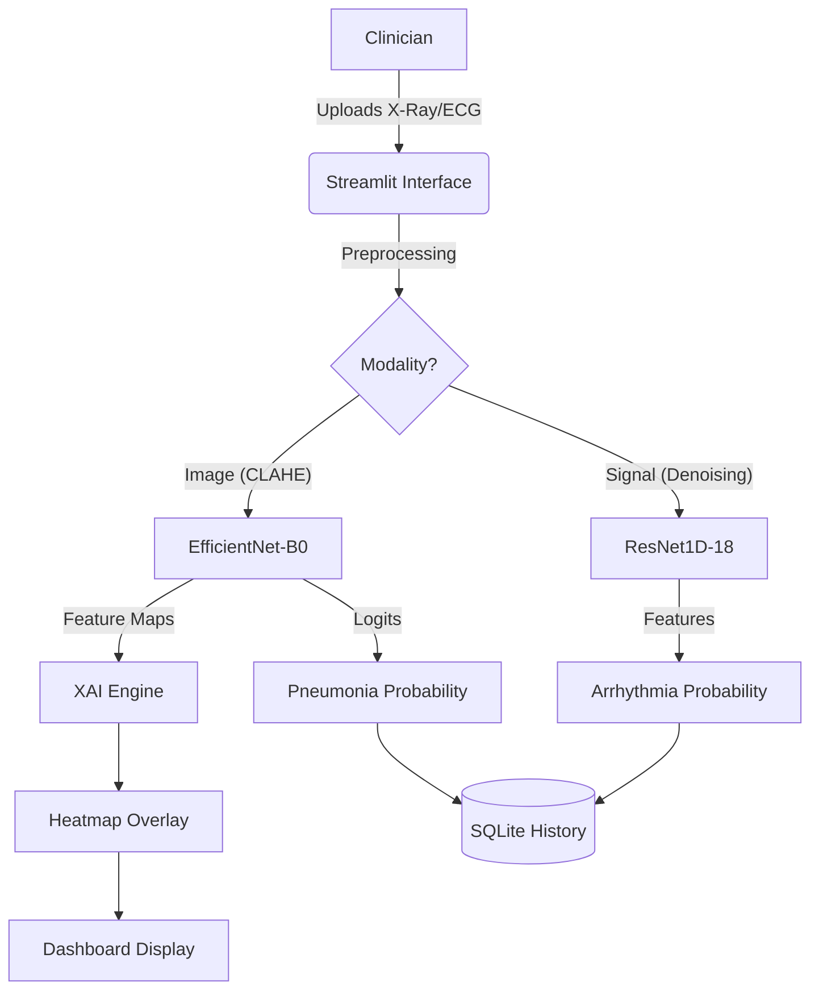

# NeuroX: AI-Powered Multi-Modal Medical Diagnostics
  

**NeuroX** is a research-grade, offline-capable medical imaging and signal processing application designed to assist clinicians in the early detection of **Pneumonia** (via Chest X-Rays) and **Cardiac Arrhythmias** (via 12-Lead ECGs).

By bridging the gap between "Black Box" Deep Learning and clinical trust, NeuroX features **Explainable AI (XAI)** to visualize exactly *why* a diagnosis was made.

---

## 🌟 Key Features

### 1. Advanced Chest X-Ray Analysis (Vision)
*   **Model**: Fine-tuned `EfficientNet-B0` / `MobileNetV2` (Transfer Learning).
*   **Performance**: Optimized for high sensitivity in detecting lung opacities.
*   **Explainability**: Integrated **Grad-CAM (Gradient-weighted Class Activation Mapping)** generates a heatmap overlay, pinpointing the exact lung regions contributing to the "Pneumonia" prediction.
*   **Smart Contrast**: Built-in CLAHE (Contrast Limited Adaptive Histogram Equalization) preprocessing for enhanced visibility of bone structures and soft tissues.

### 2. Clinical-Grade ECG Interpretation (Time-Series)
*   **Model**: Custom `ResNet1D-18` (Deep Residual CNN optimized for 1D signals).
*   **Input Standard**: Supports standard 12-Lead ECG data (PTB-XL / WFDB format).
*   **Clinical RR Interval Analysis**: Advanced peak detection algorithm analyzes beat-to-beat timing variability (RR Coefficient of Variation) to detect true arrhythmias.
    *   **Baseline-wander resistant**: High-pass filtering removes drift artifacts
    *   **Clinical thresholds**: RR CV < 8% = Normal, > 12% = Arrhythmia
    *   **Hybrid decision system**: Clinical rules override model predictions for conclusive cases
*   **Diagnostics**: Classifies rhythms into **Normal Sinus Rhythm** or **Arrhythmia/Abnormality** with high clinical accuracy.
*   **Visualization**: Interactive Matplotlib rendering of Lead II rhythm strips with attention heatmaps.

### 3. Patient History Dashboard
*   **Local Database**: Built-in SQLite database automatically isolates and persists patient records—no internet required.
*   **Analytics**: Real-time dashboard showing disease prevalence rates, total scan counts, and recent diagnostic history.
*   **Audit Trail**: Every diagnosis is timestamped and logged for review.

### 4. Professional Reporting
*   **PDF Generation**: One-click generation of comprehensive medical reports containing:
    *   Patient ID & Timestamp
    *   Original Scan + AI Heatmap (side-by-side)
    *   Diagnostic Confidence & Conclusion
    *   **ECG Reports**: RR Variability, Heart Rate, R Peaks, Decision Basis
    *   Physician Notes Section

---

## 🛠 System Architecture

NeuroX runs entirely locally (Edge AI), prioritizing patient data privacy.


## 📊 Datasets Used

The models in NeuroX were trained on high-quality, open-source medical datasets.

### 1. Chest X-Ray Images (Pneumonia)
*   **Source**: Kaggle (Paul Mooney)
*   **Dataset Structure**:
    *   **Total Images**: 5,863 (JPEG)
    *   **Categories**: Pneumonia (Viral & Bacterial) vs. Normal
    *   **Split**: Organized into Training (5,216), Test (624), and Validation (16) sets.
*   **Imaging Technique**: Anterior-Posterior (AP) chest X-rays selected from retrospective cohorts of pediatric patients of one to five years old.
*   **Link**: [Chest X-Ray Images (Pneumonia) Dataset](https://www.kaggle.com/datasets/paultimothymooney/chest-xray-pneumonia)

### 2. PTB-XL ECG Database
*   **Source**: PhysioNet (Wagner et al.)
*   **Dataset Overview**:
    *   **Size**: 21,837 clinical 12-lead ECG records from 18,885 patients.
    *   **Duration**: 10 seconds per record.
    *   **Sampling Rates**: Available in 100 Hz and 500 Hz.
*   **Annotations**: Comprehensive diagnostic statements conformant to SCP-ECG standards (Normal, Myocardial Infarction, ST/T Change, Conduction Disturbance, and Hypertrophy).
*   **Demographics**: Balanced distribution of male (52%) and female (48%) patients across various age groups.
*   **Link**: [PTB-XL Database](https://physionet.org/content/ptb-xl/1.0.3/)


## 🚀 Installation & Setup

### Prerequisites
*   **OS**: Windows, macOS, or Linux
*   **Python**: 3.9+
*   **Hardware**: CDUA-capable GPU recommended for training (CPU supported for inference).

### Quick Start
1.  **Clone the Repository**:
    ```bash
    git clone https://github.com/your-repo/neuox-diagnostics.git
    cd Pneumonia_and_Heart_Disease_Detection
    ```

2.  **Install Dependencies**:
    ```bash
    pip install -r requirements.txt
    # Includes: PyTorch, Streamlit, OpenCV, scipy, wfdb, fpdf
    ```

3.  **Run the Application**:
    ```bash
    streamlit run app.py
    ```

## 📂 Project Structure

| Directory | Description |
| :--- | :--- |
| `src/models/` | PyTorch definitions for `EfficientNet` (XRay) and `ResNet1D` (ECG). |
| `src/utils/` | Helper modules for `db` (SQLite), `explainability` (GradCAM), and `preprocessing`. |
| `data/` | Raw storage for X-Ray images and PTB-XL ECG waveforms. |
| `ecg_testing/` | Auto-generated sample data for rapid testing. |
| `app.py` | Main entry point for the Streamlit web interface. |

## 🛡️ Medical Disclaimer
> **IMPORTANT**: This software is for **Research and Educational Purposes Only**. It is NOT approved by the FDA or any medical regulatory body for clinical use. It should not be used as the sole basis for medical diagnoses.

---
**Developed by Abhishek** | Powered by PyTorch & Streamlit
